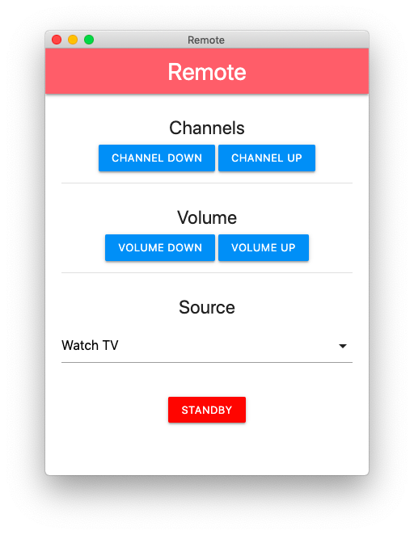

# Remote
Simple project to try out JavaScript and Electron.
The application contains a few commands to control TVs that runs the JointSpace API.



### Install
```
git clone https://github.com/andreaslarsson/Remote.git`
cd Remote
npm install
```

### Run
```
npm start
```

### Build for macOS
```
npm run package-mac
```